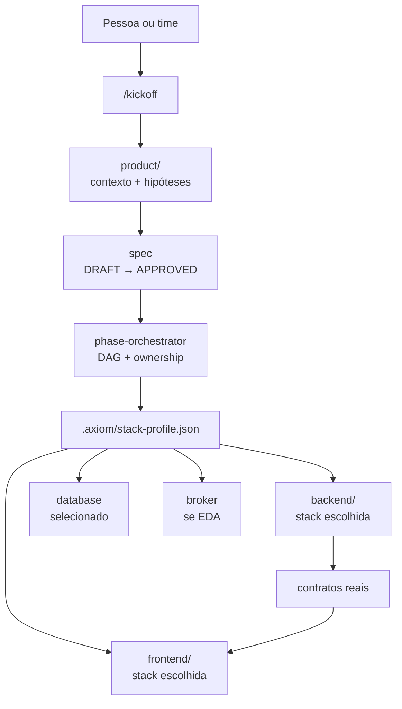
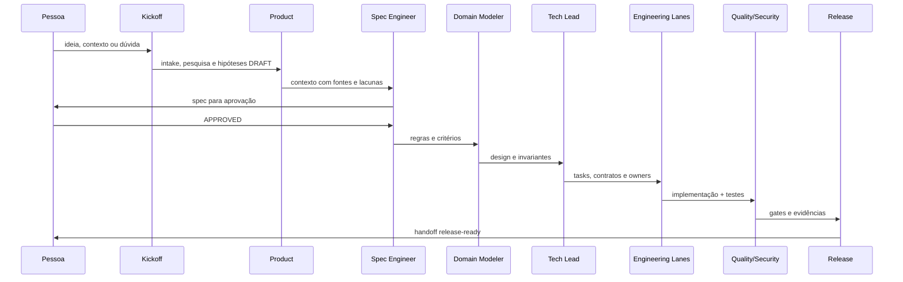

<div align="center">

# ⚒️ Axiom Forge

### A fábrica open source de projetos que transforma uma ideia em um sistema executável.

**Spec-Driven Development · agentes especialistas · stacks compatíveis · infraestrutura local**

[](https://www.npmjs.com/package/create-axiom-forge)
[](https://www.npmjs.com/package/create-axiom-forge)
[](LICENSE)
[](https://github.com/henilveira/axiom-forge/actions)
[](https://nodejs.org/)

<br />

```bash
npx create-axiom-forge meu-projeto
```

<sub>Entre com uma ideia. Saia com um projeto neutro, rastreável e pronto para descobrir o que vale a pena construir.</sub>

</div>

<br />

> Axiom Forge não é um produto com domínio pré-fabricado. É um chassi para criar outros produtos: a regra de negócio começa vazia, enquanto o método de desenvolvimento já chega vivo.

<div align="center">

| 🧭 Descobrir | 🧱 Projetar | 🔥 Forjar | 🛡️ Validar |
|:---:|:---:|:---:|:---:|
| `/kickoff` | `spec → design` | `code → test` | `quality → release` |

</div>

## Índice

- [A proposta](#a-proposta)
- [A forja como um animal](#a-forja-como-um-animal)
- [Comece em 60 segundos](#comece-em-60-segundos)
- [A experiência da CLI](#a-experiência-da-cli)
- [O que o gerador pergunta](#o-que-o-gerador-pergunta)
- [Todas as opções da CLI](#todas-as-opções-da-cli)
- [O que é criado](#o-que-é-criado)
- [O que é fixo e o que é configurável](#o-que-é-fixo-e-o-que-é-configurável)
- [Catálogo de stacks](#catálogo-de-stacks)
- [Arquiteturas e infraestrutura](#arquiteturas-e-infraestrutura)
- [Autenticação opcional](#autenticação-opcional)
- [O `/kickoff`: duas portas de entrada](#o-kickoff-duas-portas-de-entrada)
- [O sistema de agentes](#o-sistema-de-agentes)
- [Arquitetura interna](#arquitetura-interna)
- [Fluxo SDD](#fluxo-sdd)
- [Rodar o repositório](#rodar-o-repositório)
- [Qualidade, segurança e gates](#qualidade-segurança-e-gates)
- [Variáveis de ambiente](#variáveis-de-ambiente)
- [Contribuir](#contribuir)
- [Licença](#licença)

## A proposta

Começar um produto costuma exigir simultaneamente decisões de produto, arquitetura, stack, infraestrutura, convenções, agentes e processo. Quando tudo isso é decidido ao mesmo tempo, o primeiro commit já carrega escolhas difíceis de reverter — e muitas vezes carrega também regra de negócio inventada antes de existir evidência.

O Axiom Forge separa essas decisões em camadas:

```text
ideia
  ↓
perfil técnico compatível
  ↓
scaffold neutro + biblioteca de agentes
  ↓
/kickoff
  ↓
fatos, hipóteses, pesquisa e experimentos
  ↓
spec APPROVED
  ↓
design, implementação, testes e release
```

### O que você recebe

| Entrega | O que significa na prática |
|---|---|
| **Gerador npm** | Um comando que cria um projeto em outra pasta, usando somente as escolhas feitas no wizard. |
| **Produto vazio por design** | Templates para visão, personas, jornadas, hipóteses, PRDs, histórias e specs — sem persona ou feature inventada. |
| **Biblioteca de stacks** | Frontends, backends, system designs, arquiteturas, bancos, brokers e providers com compatibilidade explícita. |
| **Agentes especialistas** | Contexto por tecnologia e arquitetura para melhorar o desempenho do agente na tarefa certa. |
| **SDD operacional** | Um processo que impede implementação de avançar sem contexto e spec aprovados. |
| **Infraestrutura local** | Docker Compose para os serviços escolhidos, quando o perfil precisar de persistência ou mensageria. |
| **Autenticação opcional** | Uma fundação técnica pronta para um único perfil compatível, sem acoplar domínio de negócio. |
| **Gates reproduzíveis** | Lint, typecheck, build, testes, auditoria, segurança, paridade de agentes e revisão antes do merge. |

### O que deliberadamente não existe

O template não traz:

- entidade, tabela ou fluxo de negócio;
- persona, ICP, pricing ou posicionamento definidos;
- integração específica com uma empresa ou produto;
- feature disfarçada de exemplo;
- segredo, token, cookie ou dado de produção;
- decisão irreversível escondida em um scaffold “genérico”.

O exemplo inicial de frontend e o endpoint `/health` são apenas smoke checks técnicos. O produto real começa quando você descreve o problema no `/kickoff`.

## A forja como um animal

Para entender a arquitetura sem decorar uma lista de pastas, imagine o Axiom Forge como um animal de trabalho: cada órgão tem uma função, e nenhum órgão deveria assumir o papel do outro.

```text
                                  ┌────────────────────┐
                                  │  product/          │
                                  │  cérebro + memória │
                                  └─────────┬──────────┘
                                            │ contexto aprovado
                                            ▼
┌───────────────┐    decisões    ┌────────────────────┐    contratos    ┌───────────────┐
│ /kickoff      │ ─────────────▶ │ phase-orchestrator │ ───────────────▶ │ tech lanes    │
│ sentidos      │                │ sistema nervoso    │                  │ músculos      │
└───────────────┘                └─────────┬──────────┘                  └──────┬────────┘
                                            │                                    │
                              ┌────────────┴────────────┐              ┌─────────┴─────────┐
                              │                         │              │                   │
                       ┌──────▼──────┐           ┌──────▼──────┐ ┌─────▼─────┐      ┌────▼─────┐
                       │ frontend/   │           │ backend/    │ │ database  │      │ broker   │
                       │ olhos + face│           │ órgãos +   │ │ memória   │      │ corrente │
                       │             │           │ movimento  │ │ durável   │      │ eventos  │
                       └─────────────┘           └─────────────┘ └───────────┘      └──────────┘
```

| Órgão da forja | Pasta ou conceito | Função técnica |
|---|---|---|
| 🧠 Cérebro | `product/` | Guarda problema, contexto, hipóteses, decisões e specs. |
| 👁️ Sentidos | `/kickoff` | Capta a realidade: o que já é conhecido e o que ainda precisa de pesquisa. |
| 🧬 Sistema nervoso | `phase-orchestrator` | Recupera estado, classifica intenção, monta DAG e encaminha ownership. |
| 🐺 Matilha | agentes especialistas | Cada especialista conhece uma fronteira e não invade a responsabilidade de outro. |
| 🫀 Corrente sanguínea | broker | Leva eventos entre produtores e consumidores quando a arquitetura exige desacoplamento. |
| 🧱 Esqueleto | Git Flow + ADRs | Mantém mudanças rastreáveis, revisáveis e com decisões duráveis registradas. |
| 💪 Músculos | `backend/` e `frontend/` | Executam contratos aprovados dentro dos limites da arquitetura escolhida. |
| 🧠 Memória de longo prazo | banco | Persiste estado; migrations e constraints são parte do contrato, não detalhe posterior. |
| 🏠 Habitat | Docker Compose | Reproduz localmente banco e mensageria sem exigir uma conta cloud para começar. |

A metáfora também explica uma regra importante: o cérebro não é o músculo. `product/` decide o que precisa ser construído; os runtimes implementam somente depois da aprovação.

## Comece em 60 segundos

### Pré-requisitos

- Node.js 22 ou superior;
- npm;
- Docker Desktop ou Docker Engine + Compose, quando o perfil usar banco/broker;
- uma ferramenta de agentes compatível com o conjunto escolhido: Claude, Codex ou ambos.

### Criar um projeto

```bash
npx create-axiom-forge meu-projeto
```

O comando abre a CLI interativa. Ao terminar:

```bash
cd meu-projeto
cp .env.example .env
docker compose up -d       # somente se o perfil criou docker-compose.yml
/kickoff
```

Se você preferir o alias padrão do ecossistema npm:

```bash
npm create axiom-forge -- meu-projeto
```

Para sempre executar a versão mais recente publicada:

```bash
npx create-axiom-forge@latest meu-projeto
```

### Primeiro kickoff

O comando `/kickoff` é executado na conversa da ferramenta de agentes, dentro da raiz do projeto gerado. Ele não é um script shell.

```text
meu-projeto/
├── product/
├── frontend/       # se escolhido
├── backend/        # se escolhido
├── .agents/        # se Codex foi escolhido
├── .claude/        # se Claude foi escolhido
└── docs/
```

Na primeira sessão, diga ao agente qual dos dois contextos é verdadeiro:

```text
/kickoff

Já conheço meu mercado. Quero registrar o ICP, o problema, as alternativas,
as evidências que tenho e as hipóteses que ainda precisam ser validadas.
```

ou:

```text
/kickoff

Ainda estou explorando a ideia. Tenho apenas esta observação inicial:
<descreva a dor, para quem ela parece existir e em qual contexto aparece>.
Conduza a descoberta e pesquise o mercado antes de propor hipóteses.
```

## A experiência da CLI

O wizard usa [Ink](https://github.com/vadimdemedes/ink) para renderizar uma interface React no terminal. Ele tem navegação por setas, seleção por número, barra de progresso, filtragem de compatibilidade, spinner de geração e uma tela de conclusão.

### 1. Escolha seus copilotos

<p align="center">
  
</p>

O menu instala somente o conjunto escolhido:

| Seleção | Arquivos instalados |
|---|---|
| `Claude` | `.claude/agents`, `.claude/skills`, regras e hooks |
| `Codex` | `.agents/skills`, `AGENTS.md` e instruções da camada |
| `Claude + Codex` | Os dois dialetos, com paridade validável |

### 2. Escolha o motor e veja o catálogo filtrar

<p align="center">
  
</p>

Os system designs não aparecem como uma lista indiferente. O gerador só oferece, por exemplo, `Spring Modulith` para Spring Boot, `Go standard layout` para Go, `Angular Standalone` para Angular e `Next App Router + RSC` para Next.js.

### 3. A forja termina com um perfil rastreável

<p align="center">
  
</p>

Ao final, o projeto guarda a seleção em dois arquivos:

- `.axiom/stack-profile.json`: catálogo, stack, design, arquitetura, infraestrutura e especialistas;
- `.project-config.json`: nome, slug, nomes de banco/Compose/RabbitMQ e ferramentas instaladas.

## O que o gerador pergunta

O wizard conduz as decisões nesta ordem:

```text
1. AGENT BAY       Claude, Codex ou ambos
2. SCOPE            frontend + backend, só frontend ou só backend
3. FRONTEND        Next, Vite/React, Vite/Vue, Angular ou SvelteKit
4. FRONTEND DESIGN system design compatível com a stack
5. BACKEND         NestJS, Express, FastAPI, Go, Spring ou ASP.NET
6. BACKEND DESIGN  system design compatível com a stack
7. ARCHITECTURE    monólito, microservices, EDA, serverless ou camadas
8. DATABASE        nenhum, Postgres, MySQL, MongoDB ou SQLite
9. BROKER          nenhum, RabbitMQ, Kafka, NATS ou Redis Streams
10. PROVIDER       local, AWS, Azure, GCP, Vercel ou Cloudflare
11. AUTH TEMPLATE   nenhum ou Axiom Auth Foundation, quando compatível
```

O escopo altera o restante da experiência:

| Escopo | Frontend | Backend | Banco/broker |
|---|---:|---:|---:|
| **Frontend + Backend** | obrigatório | obrigatório | configurável |
| **Somente frontend** | obrigatório | não criado | `none` automaticamente |
| **Somente backend** | não criado | obrigatório | configurável |

## Todas as opções da CLI

### Uso automatizado

Para scripts, CI e geração reproduzível, use `--yes`. Ele desativa o Ink e usa defaults para o que não for informado:

```bash
npx --yes create-axiom-forge meu-projeto \
  --agents both \
  --mode full \
  --frontend nextjs \
  --frontend-design next-app-router \
  --backend nestjs \
  --backend-design nest-modular \
  --architecture event-driven \
  --database postgres \
  --broker rabbitmq \
  --provider local \
  --auth axiom-foundation
```

Defaults do modo não interativo:

| Opção | Default |
|---|---|
| Agentes | `both` |
| Escopo | `full` |
| Frontend | `nextjs` |
| Backend | `nestjs` |
| Arquitetura | `modular-monolith` |
| Banco | `none` |
| Broker | `none`, ou `rabbitmq` quando a arquitetura é EDA |
| Provider | `local` |
| Auth | `none` |

### Flags

| Flag | Valores | Função |
|---|---|---|
| `--agents` | `claude`, `codex`, `both` | Escolhe o dialeto de agentes instalado. |
| `--mode` | `full`, `frontend`, `backend` | Define quais camadas serão criadas. |
| `--frontend` | `nextjs`, `vite-react`, `vite-vue`, `angular`, `sveltekit` | Escolhe o frontend. |
| `--frontend-design` | ids compatíveis | Escolhe a convenção de frontend. |
| `--backend` | `nestjs`, `express`, `fastapi`, `go-gin`, `spring-boot`, `aspnet-core` | Escolhe o backend. |
| `--backend-design` | ids compatíveis | Escolhe a convenção de backend. |
| `--architecture` | `modular-monolith`, `layered-monolith`, `microservices`, `event-driven`, `serverless` | Escolhe o esqueleto de integração. |
| `--database` | `none`, `postgres`, `mysql`, `mongodb`, `sqlite` | Escolhe persistência e, quando aplicável, o container. |
| `--broker` | `none`, `rabbitmq`, `kafka`, `nats`, `redis-streams` | Escolhe mensageria e, quando aplicável, o container. |
| `--provider` | `local`, `aws`, `azure`, `gcp`, `vercel`, `cloudflare` | Registra o habitat de deploy esperado. |
| `--auth` | `none`, `axiom-foundation` | Liga o template técnico opcional de autenticação. |
| `--catalog` | — | Imprime o catálogo completo e encerra. |
| `--path` | diretório | Define a pasta-pai de saída. |
| `-y`, `--yes` | — | Desativa a UI e usa o fluxo determinístico. |
| `-h`, `--help` | — | Mostra a ajuda. |

Para consultar os ids disponíveis sem abrir um projeto:

```bash
npx --yes create-axiom-forge --catalog
```

Para gerar em outra pasta:

```bash
npx --yes create-axiom-forge meu-projeto --path ~/Documents/projetos
```

O gerador recusa diretórios já existentes. Isso evita sobrescrever código por acidente.

## O que é criado

O resultado varia pelo perfil, mas a estrutura operacional segue este formato:

```text
meu-projeto/
├── product/                         # contexto, discovery e specs; começa vazio
│   ├── docs/
│   │   ├── _templates/              # visão, PRD, jornadas, pesquisa e hipóteses
│   │   ├── product/                 # personas, jornadas e biblioteca de referência
│   │   └── knowledge/               # evidências e fontes
│   └── specs/                       # specs e manifests de execução
├── frontend/                        # somente quando escolhido
│   ├── src/
│   │   ├── app/                     # rotas e composição da stack
│   │   ├── features/                # fatias de capacidade
│   │   └── shared/                  # UI e utilitários compartilhados
│   ├── docs/engineering/
│   └── package.json                 # ou o runtime correspondente
├── backend/                         # somente quando escolhido
│   ├── src/
│   │   ├── interfaces/
│   │   ├── application/
│   │   ├── domain/
│   │   └── infrastructure/
│   ├── test/
│   └── docs/engineering/
├── docs/                            # arquitetura, processo, ADRs e estado
├── .agents/                         # se Codex foi escolhido
├── .claude/                         # se Claude foi escolhido
├── .axiom/stack-profile.json        # perfil técnico explícito
├── .project-config.json             # identidade e namespaces locais
├── .env.example                     # variáveis documentadas, sem valores reais
├── docker-compose.yml               # só quando banco/broker forem selecionados
└── README.md                        # documentação do projeto derivado
```

### Identidade e nomes da infraestrutura

O nome informado no comando é normalizado uma vez e usado de forma consistente:

```text
Entrada: Meu Produto

slug do projeto       → meu-produto
diretório             → meu-produto/
Compose project       → meu-produto
Postgres database     → meu_produto
Postgres CI database  → meu_produto_ci
RabbitMQ vhost        → /meu-produto-local
RabbitMQ exchange     → meu-produto.events
```

O slug aceita letras, números e separadores; acentos são normalizados. O nome exibido pode ter até 80 caracteres e o identificador técnico é limitado a um slug seguro.

## O que é fixo e o que é configurável

A forja precisa ter uma identidade forte sem prender o projeto a uma tecnologia específica.

### Persiste em todos os projetos

- Produto sem regra de negócio inicial;
- `/kickoff` em dois modos;
- Spec-Driven Development e estados `DRAFT`/`APPROVED`;
- ownership explícito por agente;
- Git Flow, branches, worktrees, PRs e aprovação humana;
- ADR para decisões difíceis de reverter;
- separação entre domínio, aplicação, interfaces e infraestrutura;
- contratos validados na fronteira;
- testes e gates antes do release;
- `.env.example` sem segredos reais;
- rastreabilidade por estado, task, dependência, evidência e rollback.

### Muda conforme o perfil

- presença de `frontend/` e `backend/`;
- linguagem, framework, package manager e comandos;
- convenção de pastas e system design;
- arquitetura de integração;
- banco e imagem Docker;
- broker, topologia e ports de mensageria;
- provider e restrições de deploy;
- especialistas técnicos instalados;
- template de autenticação.

O perfil selecionado é a fonte de verdade da geração. Um agente não deve inferir Next.js, Prisma, RabbitMQ ou qualquer outra tecnologia se o arquivo `.axiom/stack-profile.json` disser outra coisa.

## Catálogo de stacks

O catálogo é compatível por construção: cada opção declara seus designs, comandos, fontes e especialista. A CLI usa essa relação para evitar combinações sem sentido.

### Frontend

| Id | Stack | Designs disponíveis | Comando de desenvolvimento |
|---|---|---|---|
| `nextjs` | Next.js + React + TypeScript | `next-app-router`, `feature-based` | `npm run dev` |
| `vite-react` | Vite + React + TypeScript | `feature-based`, `atomic-design` | `npm run dev` |
| `vite-vue` | Vite + Vue + TypeScript | `vue-composition`, `feature-based`, `atomic-design` | `npm run dev` |
| `angular` | Angular + TypeScript | `angular-standalone`, `feature-based` | `npm start` |
| `sveltekit` | SvelteKit + TypeScript | `sveltekit-runes`, `feature-based` | `npm run dev` |

### Backend

| Id | Stack | Designs disponíveis | Comando de desenvolvimento |
|---|---|---|---|
| `nestjs` | NestJS + TypeScript | `nest-modular`, `ddd-layered`, `hexagonal`, `vertical-slice` | `npm run start:dev` |
| `express` | Express + TypeScript | `feature-based`, `hexagonal`, `vertical-slice` | `npm run dev` |
| `fastapi` | FastAPI + Python | `fastapi-router-service`, `hexagonal`, `vertical-slice` | `uvicorn app.main:app --reload` |
| `go-gin` | Go + Gin | `go-standard-layout`, `hexagonal` | `go run ./cmd/api` |
| `spring-boot` | Java + Spring Boot | `spring-modulith`, `ddd-layered`, `hexagonal`, `vertical-slice` | `mvn spring-boot:run` |
| `aspnet-core` | C# + ASP.NET Core | `aspnet-clean`, `vertical-slice`, `hexagonal` | `dotnet run` |

### Por que designs específicos ficam restritos

Um system design pode ser uma convenção universal ou uma prática nativa de uma tecnologia. O catálogo respeita essa diferença:

| Design | Restrição |
|---|---|
| `next-app-router` | Somente Next.js, porque depende do App Router e de RSC. |
| `vue-composition` | Somente Vite + Vue, porque depende da Composition API. |
| `angular-standalone` | Somente Angular, porque depende do modelo standalone e DI do framework. |
| `sveltekit-runes` | Somente SvelteKit, porque depende de routing e runes do Svelte. |
| `nest-modular` | Somente NestJS, porque expressa módulos e providers Nest. |
| `fastapi-router-service` | Somente FastAPI, porque expressa routers e schemas Pydantic. |
| `go-standard-layout` | Somente Go, porque usa `cmd/`, `internal/` e convenções idiomáticas. |
| `spring-modulith` | Somente Spring Boot, porque depende dos módulos funcionais Spring. |
| `aspnet-clean` | Somente ASP.NET Core, porque usa a divisão Core/Application/Infrastructure/API. |

Os designs generalistas — feature-based, hexagonal, vertical slice, DDD e atomic design — aparecem onde a adaptação é tecnicamente coerente.

## Arquiteturas e infraestrutura

### Estilos arquiteturais

| Id | Arquitetura | Quando faz sentido | Regra operacional |
|---|---|---|---|
| `modular-monolith` | Monólito modular | Um deploy, fronteiras internas fortes e caminho de extração futuro. | Módulos se comunicam por contratos explícitos. |
| `layered-monolith` | Monólito em camadas | Produto inicial simples, com fronteiras ainda em formação. | A dependência aponta para o núcleo, não para o framework. |
| `microservices` | Microservices | Bounded contexts e necessidade operacional real de deploy/escala independentes. | Cada serviço precisa de dono de estado e contrato. |
| `event-driven` | Event-Driven Architecture | Fluxos assíncronos, desacoplamento temporal e integração por eventos. | Broker é obrigatório; consumidores precisam de idempotência. |
| `serverless` | Serverless | Unidades sob demanda, eventos e provider como parte do runtime. | Limites, retry e cold starts entram no design. |

O scaffold de microservices começa com um serviço técnico. Ele não finge que separar processos é o mesmo que descobrir bounded contexts.

### Bancos

| Id | Serviço local | Porta | Perfil |
|---|---|---:|---|
| `none` | nenhum | — | Contratos e adapters sem persistência inicial. |
| `postgres` | PostgreSQL `16-alpine` | `5432` | Default relacional para transações, constraints e DDD. |
| `mysql` | MySQL `8.4` | `3306` | Relacional com ecossistema amplo de hospedagem. |
| `mongodb` | MongoDB `8` | `27017` | Documentos e agregados com schema flexível. |
| `sqlite` | arquivo local | — | Protótipos, CLIs e serviços de baixa concorrência. |

### Brokers

| Id | Serviço local | Porta principal | Perfil |
|---|---|---:|---|
| `none` | nenhum | — | Chamadas síncronas; incompatível com EDA. |
| `rabbitmq` | RabbitMQ `3-management-alpine` | `5672` / `15672` | AMQP, exchanges, filas e painel de management. |
| `kafka` | Apache Kafka `4.3.1` | `9092` | Tópicos, partições, retenção e replay. |
| `nats` | NATS `2.11-alpine` | `4222` / `8222` | Pub/sub, request/reply e JetStream opcional. |
| `redis-streams` | Redis `7-alpine` | `6379` | Streams leves e consumer groups. |

O Compose gerado é um ambiente de desenvolvimento local. Não é uma topologia de produção: alta disponibilidade, TLS, autenticação, backup, retenção, observabilidade e disaster recovery continuam sendo decisões do projeto.

### Providers

| Id | Alvo | Observação |
|---|---|---|
| `local` | Docker Compose | Desenvolvimento reproduzível sem credenciais externas. |
| `aws` | AWS | ECS/Fargate, Lambda, RDS e serviços gerenciados conforme o design. |
| `azure` | Microsoft Azure | Container Apps, App Service, Functions e dados gerenciados. |
| `gcp` | Google Cloud | Cloud Run, Cloud Functions e serviços gerenciados. |
| `vercel` | Vercel | Frontend/Next; o backend permanece um deploy separado. |
| `cloudflare` | Cloudflare | Edge/frontend e Workers; limitações do runtime precisam ser explícitas. |

Providers `vercel` e `cloudflare` são marcados como frontend-only pelo catálogo e não aparecem para um projeto somente backend.

## Autenticação opcional

O gerador tem duas escolhas:

| Id | O que acontece |
|---|---|
| `none` | O projeto começa totalmente neutro para você definir sua estratégia. |
| `axiom-foundation` | Instala a fundação técnica de autenticação já preparada, somente no perfil compatível. |

O template de autenticação só é ofertado quando todas estas condições são verdadeiras:

```text
mode      = full
frontend  = nextjs
backend   = nestjs
database  = postgres
broker    = rabbitmq
provider  = local
```

Quando ativado, ele inclui fundação técnica para:

- cadastro e login por e-mail/senha;
- verificação de e-mail e magic link;
- sessões com cookies seguros e refresh token;
- CSRF, allowlist de origens e rate limit;
- fingerprint, revogação e famílias de sessão;
- Google OIDC opcional, desligado por padrão;
- provider de e-mail em memória para desenvolvimento;
- Resend opcional para envio real;
- eventos, outbox/inbox e topologia RabbitMQ;
- persistência, migrations e concorrência via Prisma/PostgreSQL.

Isso não é uma regra de produto: não existe usuário de negócio, plano, organização, tenant ou fluxo específico embutido. É uma fundação de infraestrutura para o projeto derivado decidir como evoluir.

Se você escolher qualquer outro perfil, o projeto será gerado sem autenticação pronta e sem tentar copiar a convenção desse preset para uma stack incompatível.

## O `/kickoff`: duas portas de entrada

O kickoff é a primeira skill de produto. Ele existe para que agentes não confundam uma frase de intenção com uma decisão de engenharia.

### Modo A — mercado conhecido

Use quando você já tem informações de mercado. O agente estrutura e confronta o que você sabe:

```text
Tenho um ICP definido.
O problema observado é...
Hoje as pessoas resolvem isso com...
Tenho estas evidências...
Minhas hipóteses são...
Ainda não sei...
```

Saída esperada:

- intake do problema e do contexto;
- ICP e segmentos provisórios;
- alternativas e substitutos;
- evidências com fonte/status;
- lacunas explícitas;
- hipóteses e perguntas que precisam de validação;
- próximos experimentos.

### Modo B — descoberta assistida

Use quando você ainda está formando a hipótese. O agente pergunta o mínimo necessário sobre a observação inicial e pesquisa o mercado antes de propor uma tese.

A investigação deve separar:

```text
FATO observado → INFERÊNCIA → HIPÓTESE → EXPERIMENTO
```

O escopo de pesquisa pode incluir:

- tamanho e recorte de mercado;
- segmentos e linguagem usada pelo público;
- concorrentes diretos, indiretos e substitutos;
- sinais de demanda e comportamento;
- jobs-to-be-done e contexto de uso;
- modelos de negócio e disposição a pagar;
- tendências, regulação, barreiras e riscos;
- fontes primárias, limitações e grau de confiança.

Saídas comuns:

```text
product/docs/kickoffs/<data>-<slug>.md
product/docs/research/<slug>-market-research.md
product/docs/product/hypotheses/<slug>-market-hypotheses.md
```

### O que o kickoff não faz

O kickoff não cria endpoint, tabela, tela, regra de negócio, pricing ou integração. Ele prepara contexto. O `spec-engineer` transforma esse contexto em uma spec; uma pessoa precisa aprová-la antes de a engenharia de produto começar.

## O sistema de agentes

Os agentes são uma biblioteca de especialistas, não uma coleção de personas decorativas. Cada papel tem ownership, entradas, saídas e gates.

### Roster técnico cross-squad

| Agente | Pergunta que responde | Entrega principal |
|---|---|---|
| `phase-orchestrator` | Quem deve fazer o próximo trabalho e com quais dependências? | DAG mínimo, delegações e retomada de estado. |
| `spec-engineer` | O que exatamente precisa ser verdade para o produto? | Requisitos, regras, contratos e critérios de aceite. |
| `domain-modeler` | Qual modelo de domínio preserva invariantes sem acoplar framework? | Bounded contexts, entidades, agregados, eventos e design. |
| `tech-lead` | Como dividir a entrega sem criar dependências perigosas? | Plano file-level, contratos, tasks e owners. |
| `backend-data-engineer` | Como persistir, migrar e integrar dados com segurança? | Schema, migrations, repositories, adapters e concorrência. |
| `backend-engineer` | Como implementar a fatia no serviço? | Domínio, aplicação, HTTP, Swagger e testes backend. |
| `frontend-engineer` | Como consumir contratos e compor a experiência? | Schemas, services, queries, mutations, forms e composição. |
| `frontend-ui-engineer` | Como construir a UI sem esconder regra ou transporte? | Componentes reutilizáveis, acessibilidade e tokens. |
| `test-engineer` | Como provar os critérios de aceite? | Unit, integration, contract, E2E, builders e fixtures. |
| `quality-engineer` | A entrega está coerente, mantível e dentro do contrato? | Review arquitetural, regressão e gates de qualidade. |
| `security-reviewer` | Onde estão auth, autorização, secrets e superfícies de ataque? | Threat trace, hardening e evidência de segurança. |
| `release-engineer` | A mudança pode ser entregue com segurança? | Gates consolidados, rollback e handoff release-ready. |
| `git-flow-specialist` | Como integrar sem perder rastreabilidade? | Branch, worktree, PR, aprovação e merge. |

### Roster de Produto

Quando a camada de Produto é instalada, ela também recebe especialistas locais para discovery e gestão:

| Agente | Foco |
|---|---|
| `product-orchestrator` | Coordenação do squad de Produto. |
| `product-owner` | Valor, prioridades e critérios de decisão. |
| `business-analyst` | Problema, processos, regras e evidências. |
| `product-manager` | Visão, roadmap, métricas e trade-offs. |
| `ux-researcher` | Pesquisa, comportamento, contexto e validação. |
| `product-designer` | Jornadas, fluxos e experiência do produto. |
| `jira-planner` | Quebra de trabalho e rastreabilidade de execução. |
| `spec-engineer` | Especificação orientada a contexto e aceite. |

### Especialistas adicionados pelo perfil

O gerador também inclui orientação técnica específica para:

```text
frontend:   Next.js · Vite/React · Vite/Vue · Angular · SvelteKit
backend:    NestJS · Express · FastAPI · Go/Gin · Spring Boot · ASP.NET Core
arch:       modular monolith · microservices · event-driven · serverless
data:       PostgreSQL · MySQL · MongoDB · SQLite
broker:     RabbitMQ · Kafka · NATS · Redis Streams
provider:   AWS · Azure · GCP · Vercel · Cloudflare
```

O especialista de Kafka não deve dar instruções de RabbitMQ; o especialista de Spring Modulith não deve impor a estrutura de NestJS. O perfil explícito existe para reduzir esse tipo de ruído.

## Arquitetura interna

### Backend: o domínio é o centro

Quando o design DDD/camadas ou hexagonal é selecionado, a direção de dependências segue:

```text
interfaces → application → domain ← infrastructure
```

- `interfaces/` traduz HTTP, DTOs, Swagger, cookies, CSRF e erros públicos;
- `application/` coordena casos de uso e ports;
- `domain/` contém políticas e invariantes sem importar framework, I/O, SDK, logger ou relógio global;
- `infrastructure/` implementa Prisma, banco, broker, e-mail, criptografia e providers;
- eventos, retries, idempotência e observabilidade são decisões explícitas.

### Frontend: dados antes da tela

```text
schemas → types → services → queries/mutations → forms/orchestration → components/ui
```

- dados desconhecidos são validados na borda;
- services conhecem transporte, componentes visuais não;
- Server Components e Client Components têm fronteiras conscientes no Next;
- composables, standalone components, load functions e adapters respeitam a stack escolhida;
- nenhuma UI deve esconder fetch, cache ou regra de negócio.

### Contexto técnico e produto



## Fluxo SDD



### Roteamento padrão

```text
SPEC       → spec-engineer → domain-modeler → tech-lead
IMPLEMENT  → backend-data → backend → frontend → frontend-ui
FIX        → reprodução → quality/security → owner da camada → regressão
CLOSE      → test → quality/security → release → git-flow
```

Cada task precisa declarar:

```text
owner · arquivos · dependências · contrato · gate · evidência · rollback
```

Nenhuma lane deve avançar escondendo um gate vermelho, inventando regra de negócio ou usando `any`/cast para encobrir um contrato quebrado.

## Rodar o repositório

Este repositório contém o boilerplate de referência e o pacote npm. As aplicações de exemplo em `frontend/` e `backend/` são independentes.

### Instalar e subir a infraestrutura

```bash
cp .env.example backend/.env
cp frontend/.env.example frontend/.env.local
docker compose -f backend/docker-compose.yml up -d
```

Serviços locais:

| Serviço | Endereço |
|---|---|
| Frontend | http://localhost:3000 |
| Backend | http://localhost:8080 |
| Swagger | http://localhost:8080/api/docs |
| RabbitMQ Management | http://localhost:15672 |
| PostgreSQL | `localhost:5432` |

### Backend

```bash
cd backend
npm ci
npx prisma migrate deploy
npm run start:dev
```

### Frontend

```bash
cd frontend
npm ci
npm run dev
```

O usuário local padrão do Compose é `user`, com senha `password`, apenas para desenvolvimento local. Troque tudo antes de qualquer ambiente compartilhado.

### Gerador npm

```bash
cd packages/create-axiom-forge
npm ci
npm test
npm run pack:check
```

O pacote não é um workspace npm na raiz: seus testes rodam a partir de `packages/create-axiom-forge`.

## Qualidade, segurança e gates

Antes de abrir ou integrar uma mudança, rode os checks aplicáveis:

```bash
# Paridade entre agentes Claude e Codex
python3 .agents/scripts/validate-agent-parity.py

# Auditoria da esteira, Mermaid e fidelidade de specs
node scripts/audit-esteira.mjs
node scripts/validate-mermaid.mjs
node scripts/eval-spec-fidelity.mjs
```

```bash
# Backend
cd backend
npm run lint
npm run typecheck
npm run build
npm test
npm run test:contract
```

```bash
# Frontend
cd frontend
npm run lint
npm run typecheck
npm run build
npm test
```

```bash
# Pacote npm
cd packages/create-axiom-forge
npm test
npm run pack:check
```

Integrações reais de Postgres e RabbitMQ precisam dos serviços do Compose. Mocks servem para unit tests; eles não provam migration, conexão, topologia, acknowledgement, retry ou isolamento.

### Segurança por padrão

- `.env` e `.env.local` não entram no Git;
- `.env.example` contém nomes e explicações, nunca valores reais;
- secrets devem ter pelo menos 32 caracteres aleatórios;
- cookies, CSRF, CORS, rate limit e revogação são tratados como fronteiras explícitas;
- logs não devem carregar tokens, cookies, headers de autorização ou dados sensíveis;
- OAuth fica desligado por padrão;
- Compose local não deve ser exposto publicamente sem autenticação e TLS;
- decisões de segurança que mudam o risco do sistema ficam registradas em ADR.

## Variáveis de ambiente

O arquivo [`.env.example`](.env.example) é a lista canônica de configuração do boilerplate. O projeto gerado recebe uma versão adaptada ao perfil.

### Runtime e banco

| Variável | Obrigatória quando | Descrição |
|---|---|---|
| `NODE_ENV` | backend Node | `development`, `test` ou `production`. |
| `COMPOSE_PROJECT_NAME` | Compose | Namespace dos containers. |
| `PORT` | backend HTTP | Porta do serviço. |
| `DATABASE_URL` | banco selecionado | URL de conexão com o banco. |
| `RABBITMQ_URLS` | RabbitMQ selecionado | URLs AMQP do broker. |
| `RABBITMQ_VHOST` | RabbitMQ selecionado | Vhost isolado do projeto. |
| `RABBITMQ_EXCHANGE` | RabbitMQ selecionado | Exchange de eventos. |
| `RABBITMQ_PREFETCH` | RabbitMQ selecionado | Limite de mensagens por consumidor. |
| `RABBITMQ_TLS` | RabbitMQ remoto | Habilita TLS. |

### Autenticação e e-mail

| Variável | Descrição |
|---|---|
| `AUTH_FINGERPRINT_SECRET` | Segredo para fingerprint e proteção de autenticação. |
| `AUTH_COOKIE_DOMAIN` | Domínio usado pelos cookies. |
| `AUTH_ALLOWED_ORIGINS` | Allowlist de origens para CORS/CSRF. |
| `AUTH_PUBLIC_BASE_URL` | Origem usada nos links de e-mail. |
| `AUTH_EMAIL_PROVIDER` | `in-memory` em local/test ou `resend` para envio real. |
| `AUTH_EMAIL_DIAGNOSTIC_SECRET` | Proteção dos diagnósticos de e-mail. |
| `RESEND_API_KEY` | Chave do Resend, quando habilitado. |
| `GOOGLE_CLIENT_ID` | Client id do OIDC opcional. |
| `GOOGLE_CLIENT_SECRET` | Secret do OIDC opcional. |
| `GOOGLE_OAUTH_TRANSACTION_SECRET` | Segredo para o estado transacional do OIDC. |

### Frontend server-only

| Variável | Descrição |
|---|---|
| `AUTH_BACKEND_URL` | Origem do backend usada no servidor Next. Nunca transforme em `NEXT_PUBLIC_`. |
| `AUTH_PUBLIC_ORIGIN` | Origem pública do frontend. |

Nunca commite um arquivo `.env` preenchido. Em produção, use o secret manager do provider e registre a origem da configuração.

## Contribuir

O Axiom Forge é open source e aceita contribuições de código, documentação, catálogo, agentes e pesquisa.

Leia também [CONTRIBUTING.md](CONTRIBUTING.md), [CODE_OF_CONDUCT.md](CODE_OF_CONDUCT.md) e [SECURITY.md](SECURITY.md) antes de participar.

### Antes de abrir uma issue

1. Verifique se a dúvida é sobre o gerador, o catálogo, um template gerado ou um agente.
2. Inclua Node, npm, sistema operacional e versão do pacote.
3. Para bugs da CLI, inclua o comando, flags e a saída sem tokens ou secrets.
4. Para incompatibilidade de stack, inclua o perfil completo de `.axiom/stack-profile.json` sem dados sensíveis.

### Antes de abrir um pull request

1. Explique qual contrato foi alterado.
2. Diga se a mudança é cross-squad, runtime, catálogo, docs ou pacote npm.
3. Atualize testes, documentação e paridade de agentes quando aplicável.
4. Rode os gates relevantes.
5. Não introduza regra de negócio no template.
6. Não adicione dependência sem explicar por que ela é necessária ao perfil.
7. Não force uma combinação de stack só para fazer o menu mostrar uma opção.

### Evoluir o catálogo

Uma nova stack precisa declarar, no mínimo:

```text
id estável · label · linguagem · framework · descrição
system designs compatíveis · comandos · fontes · especialista
```

Uma nova arquitetura precisa declarar as dependências operacionais — por exemplo, EDA exige broker — e seu specialist. Uma nova infraestrutura precisa documentar imagem, porta, URL local, segurança e limitações de desenvolvimento.

O lugar principal para esse contrato é [`docs/engineering/stack-library/README.md`](docs/engineering/stack-library/README.md); o catálogo executável está em [`packages/create-axiom-forge/bin/catalog.mjs`](packages/create-axiom-forge/bin/catalog.mjs).

## Estrutura deste repositório

```text
axiom-forge/
├── product/                         # biblioteca de Produto vazia + estado local
├── frontend/                        # referência Next.js/React
├── backend/                         # referência NestJS/Prisma/Postgres/RabbitMQ
├── docs/                            # arquitetura, engenharia, gates e estado
├── .agents/                         # skills Codex e scripts de paridade
├── .claude/                         # agentes, skills, regras e hooks Claude
├── packages/create-axiom-forge/     # pacote npm e template distribuível
├── scripts/                         # auditorias cross-squad
├── AGENTS.md                        # contrato de trabalho do Codex
├── CLAUDE.md                        # contrato de trabalho do Claude
├── LICENSE                          # licença MIT
└── README.md                        # este documento
```

### Documentos para continuar a leitura

- [Biblioteca de stacks](docs/engineering/stack-library/README.md)
- [Camada agentica](docs/engineering/agentic-layer.md)
- [Modelo operacional](docs/engineering/operating-model.md)
- [Quality gates](docs/engineering/quality-gates.md)
- [Arquitetura do backend](docs/engineering/backend-engineering-method.md)
- [Arquitetura do frontend](docs/engineering/frontend-engineering-method.md)
- [Biblioteca de Produto](product/README.md)
- [README do pacote npm](packages/create-axiom-forge/README.md)
- [Estado vivo do boilerplate](docs/STATE.md)

## Licença

Este projeto é distribuído sob a [licença MIT](LICENSE).

Você pode usar, copiar, modificar, mesclar, publicar, distribuir, sublicenciar e vender cópias do software, respeitando as condições da licença. As dependências e imagens Docker mantêm suas próprias licenças e termos.

<div align="center">

### ⚒️ Shape the stack. Ship the hypothesis.

Feito para que a próxima ideia comece com método — não com entropia.

</div>
