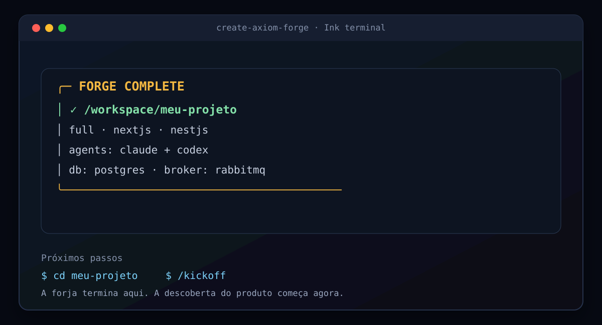
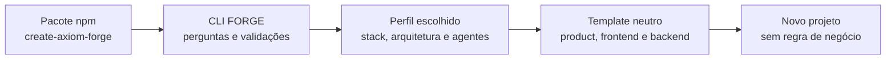
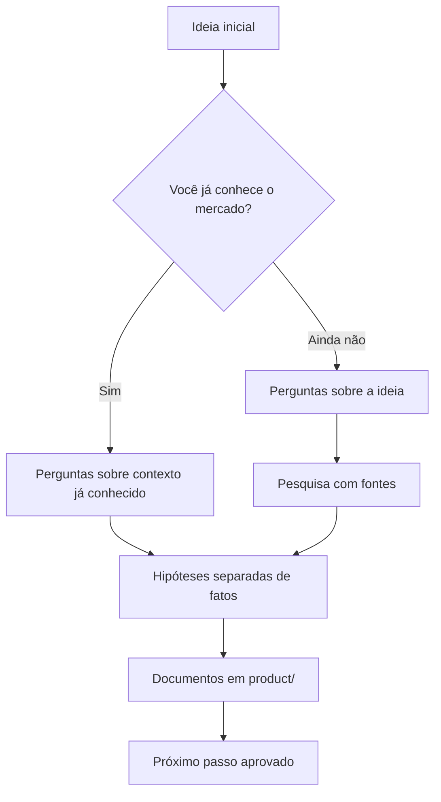
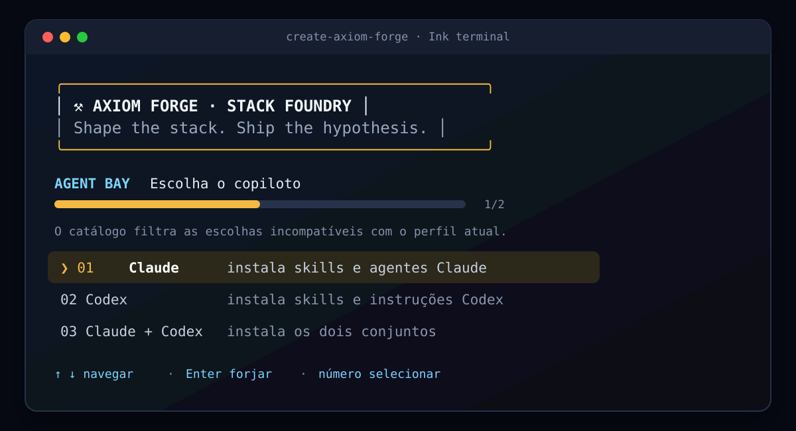
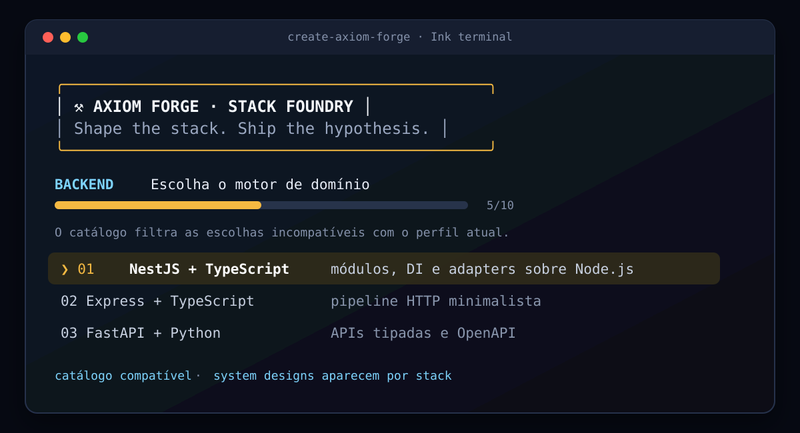
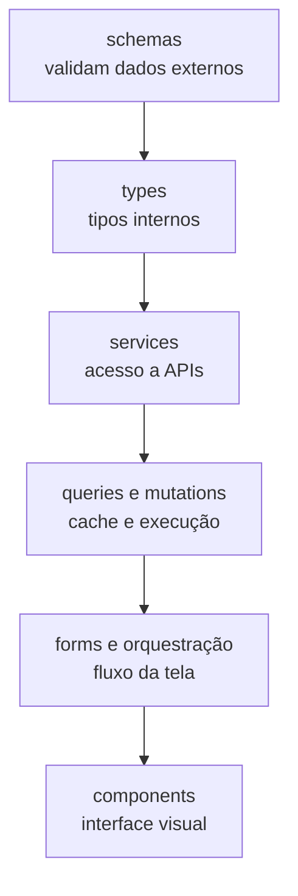
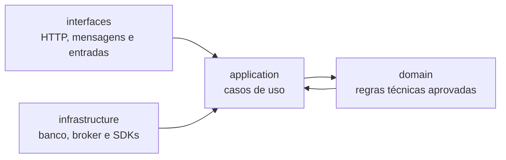
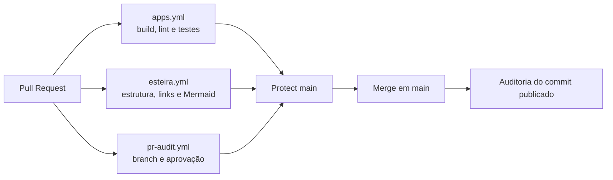

<div align="center">

# ⚒️ Axiom Forge

<a href="docs/assets/cli-complete.svg">
  
</a>

### Shape the stack. Ship the hypothesis.

Escolha a stack, organize as decisões e gere um projeto pronto para evoluir.

<p>
  <a href="https://www.npmjs.com/package/create-axiom-forge"></a>
  <a href="https://www.npmjs.com/package/create-axiom-forge"></a>
  <a href="LICENSE"></a>
  <a href="https://github.com/henilveira/axiom-forge/stargazers"></a>
  <a href="https://github.com/henilveira/axiom-forge/network/members"></a>
  <a href="https://github.com/henilveira/axiom-forge/graphs/contributors"></a>
  <a href="https://github.com/henilveira/axiom-forge/actions"></a>
  <a href="https://nodejs.org/"></a>
</p>

</div>

## O que é

Axiom Forge é um gerador de projetos e uma biblioteca de métodos para começar produtos digitais sem repetir a mesma configuração em cada repositório.

Você informa o nome do projeto, escolhe o escopo, seleciona tecnologias e decide quais agentes quer instalar. A CLI cria um projeto neutro, com documentação, testes, convenções, infraestrutura local e uma estrutura inicial de código.

O resultado não contém regra de negócio. Não há produto fictício, persona fictícia, fluxo de venda, domínio específico ou referência a um projeto anterior. O projeto começa vazio no produto e organizado na engenharia.

```bash
npx create-axiom-forge meu-projeto
```

## Arquitetura do Axiom Forge

O repositório tem duas funções:

1. O pacote em <code>packages/create-axiom-forge</code> é publicado no npm e conduz o wizard.
2. O diretório <code>packages/create-axiom-forge/template</code> é a fonte dos projetos gerados.

A raiz mantém uma cópia de referência de <code>product/</code>, <code>frontend/</code> e <code>backend/</code> para testar o boilerplate e desenvolver o próprio projeto.



## O que é gerado

O gerador cria somente as partes compatíveis com as escolhas feitas:

| Pasta ou arquivo | Finalidade |
| --- | --- |
| <code>product/</code> | Discovery, hipóteses, pesquisa, visão, jornadas, requisitos e especificações. |
| <code>frontend/</code> | Aplicação de frontend, quando o escopo inclui frontend. |
| <code>backend/</code> | Aplicação de backend, quando o escopo inclui backend. |
| <code>docs/</code> | Método de engenharia, arquitetura, qualidade, segurança e estado. |
| <code>.agents/</code> | Instruções para Codex, quando Codex foi escolhido. |
| <code>.claude/</code> | Instruções para Claude, quando Claude foi escolhido. |
| <code>.axiom/stack-profile.json</code> | Perfil completo usado na geração. |
| <code>.project-config.json</code> | Nome normalizado e namespaces dos recursos locais. |
| <code>.env.example</code> | Variáveis esperadas, sem valores secretos. |
| <code>docker-compose.yml</code> | Banco e broker escolhidos para o desenvolvimento local. |
| <code>README.md</code> | Instruções específicas do projeto gerado. |

Somente frontend não gera backend, banco ou broker. Somente backend não gera frontend. A escolha <code>full</code> gera os dois.

## Comece em poucos minutos

### 1. Gere o projeto

```bash
npx create-axiom-forge meu-projeto
```

Use as setas para navegar e <code>Enter</code> para confirmar. A CLI pergunta:

- agentes, Claude, Codex ou os dois;
- escopo, frontend e backend, somente frontend ou somente backend;
- stack e design de frontend;
- stack e design de backend;
- arquitetura;
- banco de dados;
- broker, quando a arquitetura precisar de eventos;
- provider;
- template opcional de autenticação.

### 2. Configure e execute

```bash
cd meu-projeto
cp .env.example .env
docker compose up -d
docker compose ps
```

Preencha <code>.env</code> com seus valores locais. Nunca faça commit desse arquivo.

Para desligar os serviços:

```bash
docker compose down
```

Para remover também os dados locais:

```bash
docker compose down -v
```

Use <code>down -v</code> somente quando quiser começar os dados de desenvolvimento do zero.

### 3. Inicie o produto

Na raiz do projeto gerado, abra Codex ou Claude e execute:

```text
/kickoff
```

<code>/kickoff</code> é um comando da ferramenta de agentes, não um comando do shell.

## O /kickoff

O kickoff transforma uma ideia em contexto de produto. Existem dois caminhos.

### Você já conhece o mercado

Escolha esse caminho quando já souber o problema, o público, o cliente ideal, as alternativas existentes, os sinais de demanda e o resultado esperado da primeira versão.

O agente organiza as informações, separa fatos de suposições, registra hipóteses, identifica lacunas e prepara o próximo documento.

### Você ainda está descobrindo

Escolha esse caminho quando tiver somente uma ideia ou uma dúvida. O agente faz perguntas curtas sobre a ideia, o contexto e o público imaginado. Depois realiza uma pesquisa profunda com fontes registradas, compara alternativas e separa:

- o que foi encontrado;
- o que é interpretação;
- o que ainda é hipótese;
- o que precisa ser validado com pessoas reais.

Pesquisa não vira certeza automaticamente. O resultado é um ponto de partida para testes e decisões aprovadas.



Os documentos ficam em <code>product/docs/product/</code> e <code>product/docs/knowledge/</code>. O estado fica em <code>product/docs/STATE.md</code>. As especificações ficam em <code>product/specs/</code>.

## A CLI FORGE

A CLI usa Ink. Ink é uma biblioteca que permite criar interfaces de terminal com componentes React. A experiência tem três telas principais.

### Agent Bay

Escolha Claude, Codex ou os dois.



### Stack Selection

Escolha o escopo e as tecnologias. A CLI filtra combinações incompatíveis. Um design exclusivo de Next.js, por exemplo, não aparece para Vite com Vue.



### Geração concluída

Ao terminar, a CLI mostra o perfil escolhido, a pasta criada e os próximos comandos. Essa é a tela exibida no topo deste README.

## Catálogo de escolhas

Veja o catálogo atual no terminal:

```bash
npx --yes create-axiom-forge --catalog
```

### Frontend

| Stack | Convenção inicial |
| --- | --- |
| Next.js | App Router e organização por funcionalidades. |
| Vite com React | React com estrutura feature-based. |
| Vite com Vue | Vue Composition API. |
| Angular | Standalone Components. |
| SvelteKit | Organização compatível com SvelteKit. |

### Backend

| Stack | Convenção inicial |
| --- | --- |
| NestJS | Interfaces, aplicação, domínio e infraestrutura. |
| Express | Rotas, aplicação, domínio e infraestrutura. |
| FastAPI | Routers, aplicação e domínio isolado. |
| Go com Gin | Layout padrão do Go com separação técnica. |
| Spring Boot | Módulos e opção compatível com Spring Modulith. |
| ASP.NET Core | Clean Architecture para .NET. |

### Arquiteturas

| Arquitetura | Uso | Infraestrutura |
| --- | --- | --- |
| Monólito modular | Um deploy com módulos internos separados. | Banco opcional. |
| Monólito em camadas | Aplicações pequenas ou médias com fluxo direto. | Banco opcional. |
| Microsserviços | Serviços implantados ou escalados separadamente. | Banco e broker conforme o caso. |
| Orientada a eventos | Comunicação por eventos entre componentes. | Broker obrigatório. |
| Serverless | Funções e serviços gerenciados pelo provider. | Conforme o provider. |

EDA significa Event-Driven Architecture, ou arquitetura orientada a eventos. Um componente publica um evento e outro pode reagir a ele sem uma chamada direta.

### Bancos e brokers

| Categoria | Opções |
| --- | --- |
| Banco | Nenhum, PostgreSQL, MySQL, MongoDB ou SQLite. |
| Broker | Nenhum, RabbitMQ, Kafka, NATS ou Redis Streams. |

Broker é o serviço que recebe e entrega mensagens. RabbitMQ é a opção mais simples para começar. Kafka atende cenários de alto volume e retenção. NATS é leve. Redis Streams é útil quando Redis já está presente.

Quando a arquitetura <code>event-driven</code> é escolhida, o broker não pode ser <code>none</code>.

### Providers

As opções são local, AWS, Azure, Google Cloud, Vercel e Cloudflare. Provider é a plataforma que poderá hospedar a aplicação ou fornecer serviços para ela.

Essa escolha não faz deploy automático. Ela orienta a documentação, os agentes e a infraestrutura gerada. Vercel e Cloudflare são opções voltadas principalmente para frontend e funções web.

### Autenticação

O template opcional de autenticação inclui a base técnica compatível com a seleção, como contratos, validação, cookies, sessão, verificação de email e comunicação entre frontend e backend.

Ele não inclui usuários de exemplo, permissões de negócio, planos, tenants, cobrança ou telas de um produto. A regra de negócio deve ser criada depois, por meio de especificação aprovada.

## Uso automatizado

```bash
npx --yes create-axiom-forge meu-projeto --agents both --mode full --frontend nextjs --frontend-design next-app-router --backend nestjs --backend-design nest-modular --architecture event-driven --database postgres --broker rabbitmq --provider local --auth axiom-foundation
```

| Flag | Valores |
| --- | --- |
| <code>--agents</code> | <code>claude</code>, <code>codex</code>, <code>both</code> |
| <code>--mode</code> | <code>full</code>, <code>frontend</code>, <code>backend</code> |
| <code>--frontend</code> | <code>nextjs</code>, <code>vite-react</code>, <code>vite-vue</code>, <code>angular</code>, <code>sveltekit</code> |
| <code>--frontend-design</code> | Design compatível com o frontend. |
| <code>--backend</code> | <code>nestjs</code>, <code>express</code>, <code>fastapi</code>, <code>go-gin</code>, <code>spring-boot</code>, <code>aspnet-core</code> |
| <code>--backend-design</code> | Design compatível com o backend. |
| <code>--architecture</code> | <code>modular-monolith</code>, <code>layered-monolith</code>, <code>microservices</code>, <code>event-driven</code>, <code>serverless</code> |
| <code>--database</code> | <code>none</code>, <code>postgres</code>, <code>mysql</code>, <code>mongodb</code>, <code>sqlite</code> |
| <code>--broker</code> | <code>none</code>, <code>rabbitmq</code>, <code>kafka</code>, <code>nats</code>, <code>redis-streams</code> |
| <code>--provider</code> | <code>local</code>, <code>aws</code>, <code>azure</code>, <code>gcp</code>, <code>vercel</code>, <code>cloudflare</code> |
| <code>--auth</code> | <code>none</code>, <code>axiom-foundation</code> |
| <code>--catalog</code> | Mostra o catálogo e encerra. |
| <code>--path</code> | Define a pasta-pai de saída. |
| <code>-y</code>, <code>--yes</code> | Usa os valores padrão sem perguntar. |

Defaults de <code>--yes</code>: agentes <code>both</code>, escopo <code>full</code>, Next.js, NestJS, monólito modular, sem banco, sem broker, provider local e autenticação <code>none</code>.

## Organização técnica

### Produto

<code>product/</code> começa vazio de negócio, mas contém templates para registrar hipóteses, pesquisas, jornadas, visão, requisitos, épicos e especificações. O agente deve registrar evidências e perguntas abertas, nunca inventar uma empresa.

### Frontend

As convenções variam por stack, mas o fluxo técnico esperado é este:



A interface visual não busca dados diretamente. Valores externos são validados na borda, usando o mecanismo da stack escolhida.

### Backend

O desenho técnico padrão é:



O domínio não importa framework, banco, SDK, logger global ou relógio global. A implementação muda por linguagem, mas a separação de responsabilidades continua explícita.

### Agentes prontos

| Agente | Responsabilidade |
| --- | --- |
| <code>phase-orchestrator</code> | Entende a intenção, recupera estado e coordena a fase. |
| <code>spec-engineer</code> | Escreve requisitos, contratos e critérios de aceitação. |
| <code>domain-modeler</code> | Modela o domínio técnico e decisões duráveis. |
| <code>tech-lead</code> | Divide o trabalho em tarefas seguras. |
| <code>backend-data-engineer</code> | Cuida de banco, migrations, repositories e concorrência. |
| <code>backend-engineer</code> | Implementa a fatia backend aprovada. |
| <code>frontend-engineer</code> | Implementa a fatia frontend aprovada. |
| <code>frontend-ui-engineer</code> | Cria componentes visuais reutilizáveis e acessíveis. |
| <code>test-engineer</code> | Define e implementa testes. |
| <code>quality-engineer</code> | Valida critérios, regressões e gates. |
| <code>security-reviewer</code> | Revisa autenticação, secrets, cookies e exposição de dados. |
| <code>release-engineer</code> | Consolida gates e prepara a entrega. |
| <code>git-flow-specialist</code> | Coordena branches, PRs e integração. |

Codex usa <code>.agents/</code>. Claude usa <code>.claude/</code>. A seleção muda os arquivos instalados, não muda a regra de que o código precisa de especificação aprovada.

## Workflows para iniciantes

### Branch

Branch é uma linha separada de trabalho no Git. Ela permite editar sem alterar diretamente <code>main</code>.

```bash
git switch main
git pull --ff-only origin main
git switch -c feature/PROJ-001-minha-mudanca
```

Prefixos aceitos: <code>feature/</code> para capacidade, <code>fix/</code> para correção, <code>chore/</code> para manutenção, <code>hotfix/</code> para urgência e <code>release/</code> para preparação de versão.

### Pull Request

Pull Request, ou PR, é um pedido para comparar sua branch com <code>main</code> e revisar a mudança antes da integração.

```bash
git add .
git commit -m "feat: adiciona uma capacidade"
git push -u origin feature/PROJ-001-minha-mudanca
```

Depois abra a PR no GitHub. Explique o problema, a mudança, como testar, os riscos, o rollback e o impacto no projeto gerado.

### Workflow e check

Workflow é um arquivo em <code>.github/workflows/</code> que o GitHub executa automaticamente. Check é o resultado de uma etapa. Verde significa sucesso. Vermelho significa que algo precisa ser corrigido.



<code>apps.yml</code> testa frontend, backend e gerador em toda PR e em todo push para <code>main</code>. <code>esteira.yml</code> valida documentos, links, Mermaid e fidelidade de especificação. <code>package.yml</code> testa e empacota o gerador quando o pacote muda. <code>pr-audit.yml</code> valida a branch, o destino e a aprovação humana para o commit atual. Dependabot abre atualizações de dependências.

## Ruleset e governança

O repositório usa um ruleset ativo chamado <code>Protect main</code>. Ruleset é um conjunto de regras do GitHub aplicado a branches ou tags.

| Regra | Efeito |
| --- | --- |
| Bloquear exclusão | <code>main</code> não pode ser apagada por engano. |
| Bloquear force push | O histórico de <code>main</code> não pode ser reescrito. |
| PR obrigatória | Mudanças entram por Pull Request. |
| Uma aprovação | Uma pessoa precisa revisar. |
| Revisão de CODEOWNERS | Uma pessoa definida em `.github/CODEOWNERS` precisa revisar. |
| Aprovação do último push | Código alterado depois da aprovação precisa ser revisado novamente. |
| Resolver conversas | Comentários da revisão precisam ser resolvidos. |
| Checks obrigatórios | Frontend, backend, gerador, esteira e auditoria precisam passar. |
| Branch atualizada | A PR precisa acompanhar <code>main</code> conforme a política. |
| Bypass administrativo | O maintainer principal pode usar o bypass do GitHub em uma PR própria, quando não houver outro revisor disponível. |

O arquivo <code>CODEOWNERS</code> indica quem deve revisar os arquivos, e essa revisão está exigida pelo ruleset. O ruleset é uma regra do GitHub. O <code>pr-audit</code> é uma regra automatizada do projeto. As duas camadas atuam juntas.

O bypass administrativo está limitado ao usuário proprietário configurado no ruleset. Ele existe para permitir a manutenção do projeto quando há somente um maintainer. Para mudanças de código relevantes, prefira revisão de outra pessoa. O bypass não deve ser usado para esconder um check vermelho ou ignorar uma vulnerabilidade.

### Como reproduzir em outro repositório

1. Abra <code>Settings</code> no GitHub.
2. Abra <code>Rules</code> e depois <code>Rulesets</code>.
3. Crie um <code>New branch ruleset</code>.
4. Selecione <code>main</code> como branch alvo.
5. Ative bloqueio de exclusão e force push.
6. Ative PR obrigatória, uma aprovação, aprovação do último push e resolução de conversas.
7. Confirme os nomes reais dos checks antes de torná-los obrigatórios.
8. Deixe o enforcement como <code>Active</code>.
9. Teste tudo com uma PR pequena.

Não copie nomes de checks sem verificar o GitHub. O ruleset compara o nome do contexto e um nome diferente pode bloquear a integração.

## Segurança

Estão ativados alertas de vulnerabilidade, atualizações automáticas de segurança do Dependabot, secret scanning e secret scanning push protection. Discussões estão ativadas, a wiki está desativada e branches são apagadas após o merge.

Nunca publique senha, token, cookie, chave privada ou dado real em código, issue, PR, screenshot ou log. Use <code>.env.example</code> para nomes e descrições. Use <code>.env</code> localmente e não faça commit dele.

Leia [SECURITY.md](SECURITY.md) antes de comunicar uma vulnerabilidade.

## Desenvolvimento do Axiom Forge

Pré-requisitos: Node.js 20 ou superior, npm, Git e Docker para testar serviços locais.

```bash
cd packages/create-axiom-forge
npm install
npm test
npm run pack:check
```

Validações da raiz:

```bash
node scripts/audit-esteira.mjs .
node scripts/validate-mermaid.mjs .
node scripts/eval-spec-fidelity.mjs .
python3 .agents/scripts/validate-agent-parity.py
git diff --check
```

Frontend e backend têm <code>build</code>, <code>lint</code>, <code>typecheck</code> e <code>test</code>. O workflow <code>apps.yml</code> é a referência dos gates que precisam passar no GitHub.

## Como contribuir

Leia [CONTRIBUTING.md](CONTRIBUTING.md). O fluxo é:

1. Abra uma issue para discutir um problema ou proposta.
2. Crie uma branch curta a partir de <code>main</code>.
3. Faça a menor mudança coerente.
4. Atualize testes e documentação.
5. Rode os checks locais.
6. Abra uma PR usando o template.
7. Responda aos comentários.
8. Aguarde checks verdes e aprovação humana.

São bem-vindas novas stacks, designs específicos, brokers, arquiteturas, testes de compatibilidade, correções no template e documentação para iniciantes. Não adicione regra de negócio ao boilerplate.

Use o [template de bug](.github/ISSUE_TEMPLATE/bug_report.yml), o [template de funcionalidade](.github/ISSUE_TEMPLATE/feature_request.yml) e o [template de Pull Request](.github/PULL_REQUEST_TEMPLATE.md).

O [Código de Conduta](CODE_OF_CONDUCT.md) explica o padrão esperado nas discussões.

## Licença

Este projeto é open source sob a [licença MIT](LICENSE). Você pode usar, copiar, modificar, publicar e distribuir o projeto conforme os termos da licença.

As tecnologias geradas podem ter licenças próprias. Ao adicionar uma stack ou dependência ao catálogo, verifique e documente a licença dela.

## Estrelas e colaboradores

Se o Axiom Forge for útil, uma estrela ajuda outras pessoas a encontrar o projeto. Este gráfico é atualizado pelo Star History:

<div align="center">
  <a href="https://star-history.com/#henilveira/axiom-forge&Date">
    
  </a>
</div>

Esta imagem mostra pessoas com contribuições públicas no repositório, não a lista de permissões administrativas:

<div align="center">
  <a href="https://github.com/henilveira/axiom-forge/graphs/contributors">
    
  </a>
</div>

| Pessoa | Papel atual |
| --- | --- |
| [@henilveira](https://github.com/henilveira) | Maintainer e autor inicial. |

Quando novas pessoas contribuírem, o GitHub e os serviços vinculados atualizarão os gráficos.

## Glossário

| Termo | Significado |
| --- | --- |
| Agente | Instruções para uma ferramenta de inteligência artificial executar uma responsabilidade. |
| API | Interface para um software conversar com outro software. |
| Backend | Parte que executa regras, acessa dados e oferece serviços. |
| Broker | Serviço que recebe e entrega mensagens. |
| Check | Resultado de uma validação automática. |
| CI | Continuous Integration, ou integração contínua, validações automáticas a cada mudança. |
| CLI | Command-Line Interface, ou interface de linha de comando. |
| Container | Processo isolado que empacota um serviço. |
| EDA | Event-Driven Architecture, ou arquitetura orientada a eventos. |
| Frontend | Parte com a qual a pessoa interage. |
| Gate | Condição que precisa ser atendida para avançar. |
| ICP | Ideal Customer Profile, ou perfil de cliente ideal. |
| PR | Pull Request, pedido de revisão e integração de uma branch. |
| Provider | Plataforma que hospeda a aplicação ou oferece infraestrutura. |
| Ruleset | Conjunto de regras do GitHub para branches ou tags. |
| SDD | Spec-Driven Development, desenvolvimento orientado por especificações. |
| Secret | Informação sensível, como senha, token ou chave privada. |
| Stack | Conjunto de tecnologias usadas em uma parte do sistema. |
| Typecheck | Verificação automática dos tipos do código. |
| Workflow | Arquivo que define tarefas automáticas no GitHub Actions. |

## Links

- [Gerador no npm](https://www.npmjs.com/package/create-axiom-forge)
- [Issues](https://github.com/henilveira/axiom-forge/issues)
- [Discussões](https://github.com/henilveira/axiom-forge/discussions)
- [Pull Requests](https://github.com/henilveira/axiom-forge/pulls)
- [Contribuição](CONTRIBUTING.md)
- [Código de Conduta](CODE_OF_CONDUCT.md)
- [Segurança](SECURITY.md)
- [Licença](LICENSE)

<div align="center">

⚒️ Shape the stack. Ship the hypothesis.

</div>
