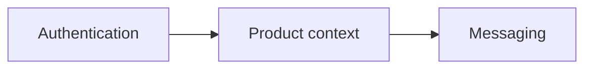

# Context Map

O boilerplate não define bounded contexts de negócio. Preencha este mapa
somente depois que uma spec aprovada introduzir um contexto.

## Contextos técnicos disponíveis

| Contexto | Tipo | Responsabilidade |
|---|---|---|
| Authentication | supporting | identidade, credenciais, sessão e proteção de acesso |
| Messaging | generic | publicação, consumo, retry, DLQ e observabilidade de eventos |
| `<contexto do produto>` | `<core/supporting/generic>` | `<responsabilidade aprovada>` |

## Relações

Não adicione produto, tenancy, pricing, personas ou integrações ao template.
Cada relação real precisa de contrato, owner, versão e estratégia de rollback.
