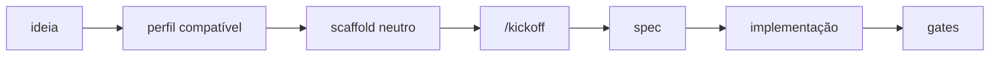
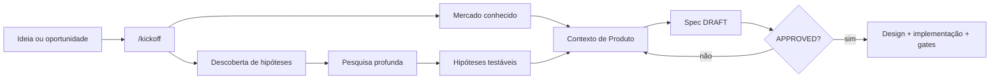
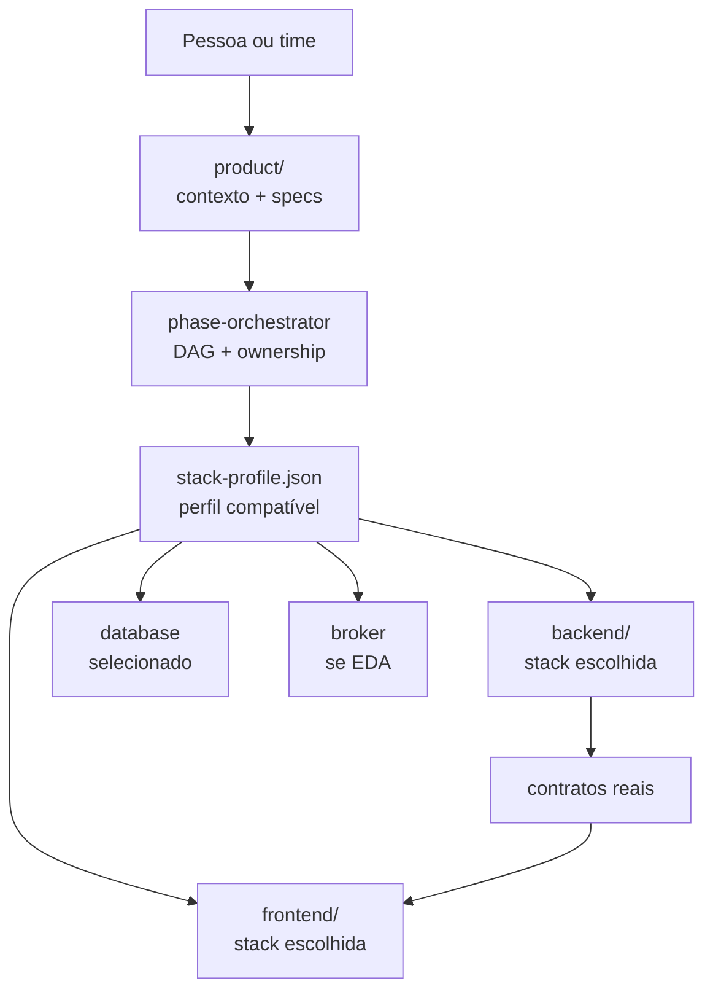
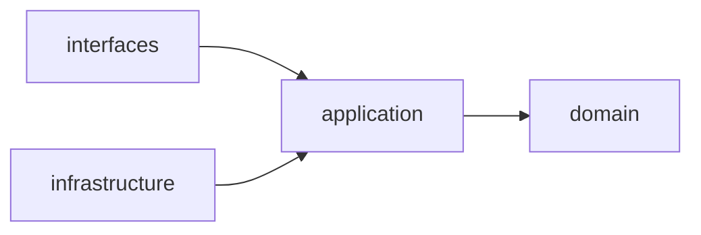
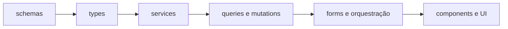
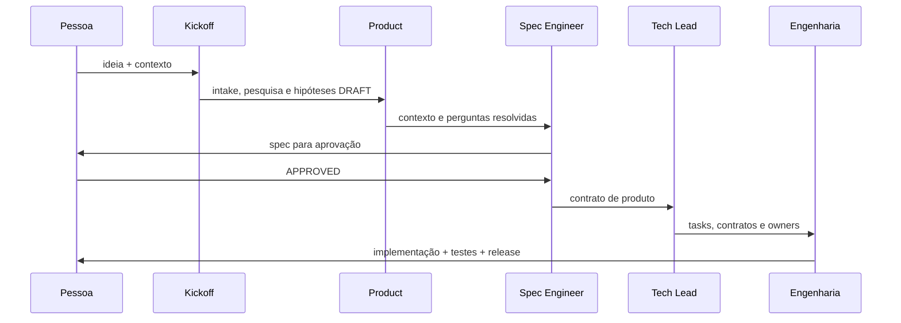

<div align="center">

# ⚒️ Axiom Forge

### A forja de projetos que transforma uma ideia em produto, com método, agentes e infraestrutura prontos.

**Zero regra de negócio. Máxima alavancagem para começar direito.**

`SDD` · `Next.js` · `NestJS` · `Go` · `Spring Boot` · `FastAPI` · `Claude` · `Codex` · `Copilot`

</div>

<br />

> Axiom Forge é um boilerplate reutilizável para criar produtos digitais sem
> começar do zero — nem no código, nem no processo de decisão.

<div align="center">

| 🚀 Criar projeto | 🧭 Descobrir produto | 🧱 Executar com segurança |
|:---:|:---:|:---:|
| `npx create-axiom-forge meu-projeto` | `/kickoff` | `spec → design → code → gates` |

</div>

## Índice

- [O que é](#o-que-é)
- [Catálogo de stacks](#catálogo-de-stacks)
- [Como a forja funciona](#como-a-forja-funciona)
- [O que já vem pronto](#o-que-já-vem-pronto)
- [Arquitetura](#arquitetura)
- [Agentes](#agentes)
- [Criar um projeto novo](#criar-um-projeto-novo)
- [Rodar este repositório](#rodar-este-repositório)
- [Kickoff: duas formas de descobrir](#kickoff-duas-formas-de-descobrir)
- [Autenticação e infraestrutura](#autenticação-e-infraestrutura)
- [Fluxo SDD](#fluxo-sdd)
- [Gates e comandos úteis](#gates-e-comandos-úteis)
- [Princípios](#princípios)

## O que é

O Axiom Forge é uma **fábrica de projetos**, não um produto final. Ele combina
Spec-Driven Development, uma biblioteca de agentes especialistas e um gerador
de perfis técnicos compatíveis.

Ele entrega o chassi técnico e operacional para que cada novo projeto possa
nascer com:

- uma biblioteca de Produto deliberadamente vazia;
- um Frontend e/ou Backend somente quando você escolher;
- Next.js, Vite, Vue, Angular, SvelteKit, NestJS, Express, FastAPI, Go/Gin,
  Spring Boot e ASP.NET Core;
- PostgreSQL, MySQL, MongoDB e SQLite; RabbitMQ, Kafka, NATS e Redis Streams;
- autenticação técnica opcional, limitada ao preset compatível Next + Nest +
  Postgres + RabbitMQ + local;
- uma esteira de agentes para discovery, especificação, implementação, testes,
  segurança e release;
- um comando `/kickoff` que começa pela realidade do produto, não por telas
  inventadas.

O nome vem da ideia de uma forja: você entra com uma ideia, uma dor ou uma
oportunidade e sai com um projeto estruturado, rastreável e pronto para evoluir.

## Catálogo de stacks

O CLI pergunta o escopo — frontend + backend, somente frontend ou somente
backend — e então filtra system designs que fazem sentido para a stack. O
mesmo fluxo permite escolher arquitetura, banco, broker, provider e agentes.



A matriz completa e a pesquisa que a fundamenta ficam em
[docs/engineering/stack-library/README.md](docs/engineering/stack-library/README.md)
e [product/docs/engineering/report-source.md](product/docs/engineering/report-source.md).

## Como a forja funciona



O fluxo tem uma regra simples: **hipótese não é requisito e requisito não é
implementação**. Cada passo deixa evidência para o próximo.

## O que já vem pronto

| Camada | Entrega | Estado inicial |
|---|---|---|
| 📚 `product/` | Templates de visão, personas, jornadas, PRD, MVP, histórias, specs, pesquisa e hipóteses | Vazia por design |
| 🖥️ `frontend/` | stack selecionada, com exemplo visual e convenção compatível | Somente se escolhido |
| ⚙️ `backend/` | stack selecionada, com `/health` e estrutura inicial | Somente se escolhido |
| 🧠 `.agents/` | Skills compartilhadas, orquestração e roster técnico | Codex ou Antigravity |
| 🤖 `.claude/` | Agentes Claude, regras, hooks e skills compartilhadas | Claude Code |
| 🧩 `.github/`, `.cursor/`, `.windsurf/` | Adapters nativos de Copilot, Cursor e Windsurf | Conforme seleção |
| 🧰 `.kimi-code/`, `.gemini/`, `.cline/`, `.roo/`, `.kiro/` | Adapters nativos dos providers | Conforme seleção |
| ☁️ `.amazonq/`, `.continue/`, `.opencode/` | Regras e skills dos demais providers | Conforme seleção |
| 🛡️ `docs/` | Arquitetura, ADRs, método, qualidade, segurança e estado | Contrato operacional |
| 🐳 Docker | banco e/ou broker escolhidos | Desenvolvimento local |

### O que não vem

Não existe contexto de negócio, persona, feature, domínio, tabela de produto,
pricing ou integração específica. A landing inicial é apenas uma tela de
arranque visual; o Produto real começa no `/kickoff`.

## Arquitetura



### Backend: fronteiras claras quando o design de domínio for selecionado



- o núcleo de domínio não conhece framework, I/O, SDK, logger ou relógio global;
- `application/` coordena casos de uso, políticas e ports explícitas;
- `infrastructure/` implementa persistência, mensageria, e-mail e criptografia;
- `interfaces/` traduz HTTP, Swagger, cookies, CSRF e erros públicos;
- efeitos externos passam por ports, com idempotência, retry e observabilidade.

### Frontend: dados antes da tela



O frontend segue a convenção da stack selecionada: Server Components no Next,
Composition API no Vue, standalone/DI no Angular ou routing/load no SvelteKit.
Contratos devem validar dados desconhecidos e componentes visuais não escondem
fetch, cache ou regra de negócio.

### Mapa do repositório

```text
axiom-forge/
├── product/                 # Produto: discovery, hipóteses, PRDs e specs
├── frontend/                # stack escolhida para UI
├── backend/                 # stack escolhida para API/serviço
├── docs/                    # Arquitetura, ADRs, método e estado
├── .agents/                 # Codex ou Antigravity
├── .claude/                 # Claude Code
├── .github/                 # GitHub Copilot
├── .cursor/                 # Cursor
├── .windsurf/               # Windsurf
├── .kimi-code/              # Kimi Code
├── .gemini/                 # Gemini CLI
├── .cline/                  # Cline
├── .roo/ + .roomodes        # Roo Code
├── .kiro/                   # Kiro
├── .amazonq/                # Amazon Q
├── .continue/               # Continue
├── .opencode/               # OpenCode
├── packages/
│   └── create-axiom-forge/  # Gerador npm + template distribuível
├── scripts/                 # Auditorias e gates cross-squad
├── .env.example             # Mapa de variáveis e secrets necessários
└── README.md
```

## Agentes

Os agentes são especialistas com ownership explícito. O orquestrador monta o
DAG mínimo, entrega cada tarefa ao papel correto e persiste o estado para a
próxima sessão.

| Papel | Responsabilidade |
|---|---|
| `phase-orchestrator` | Interpreta intenção, recupera estado e coordena o DAG |
| `spec-engineer` | Converte discovery em requisitos, regras e critérios de aceite |
| `domain-modeler` | Modela bounded contexts, invariantes e decisões de domínio |
| `tech-lead` | Decompõe solução, contratos, tasks e dependências |
| `backend-data-engineer` | Prisma, schema, migrations, repositories e adapters |
| `backend-engineer` | Casos de uso, domínio, HTTP, Swagger e testes do Backend |
| `frontend-engineer` | Schemas, services, queries, mutations, forms e composição |
| `frontend-ui-engineer` | UI pura, tokens, acessibilidade e consistência visual |
| `test-engineer` | Unit, integration, contract, E2E, fixtures e builders |
| `quality-engineer` | Review arquitetural, manutenção e gates de qualidade |
| `security-reviewer` | Auth, autorização, secrets, CSRF, cookies e threat trace |
| `release-engineer` | Evidência de entrega, rollback e release readiness |
| `git-flow-specialist` | Branch, worktree, PR, aprovação e integração no GitHub |

Além do roster, `/kickoff` é a skill de entrada para discovery. `camada-agentica`
mantém a própria biblioteca e `visual-first` ativa construção visual isolada;
ambas ficam fora da paridade 1:1 de execução.

### Providers de agentes

Ao criar um projeto pelo npm, escolha:

| Opção | O que instala |
|---|---|
| `claude` | agentes, skills, regras e hooks em `.claude/` |
| `codex` | skills e `AGENTS.md` em `.agents/` |
| `copilot` | custom agents, skills e instruções em `.github/` |
| `cursor` | regras MDC em `.cursor/rules/` |
| `windsurf` | skills, regras e workflows em `.windsurf/` |
| `kimi` | custom agents e skills em `.kimi-code/` e `.kimi/` |
| `antigravity` | skills, regras e workflows em `.agents/` |
| `gemini` | `GEMINI.md`, skills e comando `/kickoff` |
| `cline` | skills e regras em `.cline/` e `.clinerules/` |
| `roo` | custom modes em `.roomodes` e regras `.roo/` |
| `kiro` | agents, steering e skills em `.kiro/` |
| `amazon-q` | regras em `.amazonq/rules/` |
| `continue` | regras em `.continue/rules/` |
| `opencode` | `AGENTS.md` e skills em `.opencode/` |

Use vários providers no wizard ou com `--agents claude,codex,copilot`. `both`
continua aceito como alias de Claude + Codex, e `all` seleciona todos os
adapters. Agent Skills usam `SKILL.md`; Cursor, Amazon Q, Continue e Roo Code
recebem regras ou modes porque esse é o formato documentado por eles.

## Criar um projeto novo

O caminho recomendado é gerar um projeto derivado com o pacote npm:

```bash
npx create-axiom-forge meu-projeto
```

Ou, usando o alias do npm:

```bash
npm create axiom-forge -- meu-projeto
```

O nome é obrigatório e o CLI abre um menu:

```text
Quem vai trabalhar com você?
  [x] 01 Claude Code       ★ recomendada
  [x] 02 Codex             ★ recomendada
  [ ] 03 GitHub Copilot
  [ ] 04 Cursor
  ...
Space marca, Enter confirma
```

Para automação, escolha sem menu:

```bash
npx --yes create-axiom-forge meu-projeto --agents both --mode full \
  --frontend vite-react --backend go-gin \
  --architecture event-driven --database postgres --broker rabbitmq \
  --provider local --auth none
```

Veja todas as opções com `npx --yes create-axiom-forge --catalog`. O gerador
filtra system designs incompatíveis, cria somente frontend/backend escolhidos e
instala os especialistas do perfil. `axiom-foundation` é o template opcional de
autenticação, preservado apenas para o perfil compatível Next + Nest + Postgres
+ RabbitMQ + local; todos os demais perfis começam sem regra de auth.

### O nome vira infraestrutura

Para `Meu Produto`, o gerador produz:

| Uso | Valor gerado |
|---|---|
| Diretório | `meu-produto/` |
| Compose project | `meu-produto` |
| Banco PostgreSQL | `meu_produto` |
| Vhost RabbitMQ | `/meu-produto-local` |
| Exchange RabbitMQ | `meu-produto.events` |
| Banco de CI | `meu_produto_ci` |

O projeto recebe um `.project-config.json` com esses nomes para que ferramentas
e automações consigam recuperar a configuração sem inferência.

## Rodar este repositório

### Pré-requisitos

- Node.js 22 ou superior;
- npm;
- Docker com Docker Compose;
- Python 3 para o verificador de paridade.

### Subir a stack local

```bash
cp .env.example backend/.env
cp frontend/.env.example frontend/.env.local
docker compose -f backend/docker-compose.yml up -d
```

Em terminais separados:

```bash
cd backend
npm ci
npx prisma migrate deploy
npm run start:dev
```

```bash
cd frontend
npm ci
npm run dev
```

| Serviço | Endereço |
|---|---|
| Frontend | http://localhost:3000 |
| Backend | http://localhost:8080 |
| Swagger | http://localhost:8080/api/docs |
| RabbitMQ Management | http://localhost:15672 |
| PostgreSQL | `localhost:5432` |

O usuário local do Postgres é `user`, a senha é `password` e o banco inicial é
`application`. Em um projeto gerado, esses nomes são derivados do nome do
projeto.

## Kickoff: duas formas de descobrir

Depois de gerar o projeto:

```bash
cd meu-projeto
/kickoff
```

O kickoff pergunta primeiro qual realidade você está vivendo.

| Modo | Quando usar | Resultado |
|---|---|---|
| 📌 **Mercado conhecido** | Você já tem ICP, problema, evidências e alternativas mapeadas | Intake estruturado, lacunas e decisões provisórias |
| 🔎 **Descoberta de hipóteses** | Você ainda está explorando a ideia | Pesquisa profunda, fontes, hipóteses e experimentos sugeridos |

No segundo modo, a pesquisa cobre tamanho e recorte de mercado, segmentos,
concorrentes e substitutos, sinais de demanda, linguagem do público, jobs-to-be-done,
modelos de negócio, tendências, regulação, barreiras e riscos.

Toda afirmação fica separada em:

```text
FATO observado → INFERÊNCIA → HIPÓTESE → EXPERIMENTO
```

Os artefatos saem em `product/` e permanecem `DRAFT`:

```text
product/docs/kickoffs/<data>-<slug>.md
product/docs/research/<slug>-market-research.md
product/docs/product/hypotheses/<slug>-market-hypotheses.md
```

O `/kickoff` não cria endpoint, tabela, tela, regra de negócio, pricing ou
integração. Ele prepara contexto para o `spec-engineer`; somente uma spec
`APPROVED` libera engenharia.

## Autenticação e infraestrutura

O Backend já chega com a fundação técnica de autenticação, sem acoplar uma
regra de negócio específica:

- cadastro e login por e-mail/senha;
- magic link e verificação de e-mail;
- sessão com cookies seguros e refresh token;
- CSRF e allowlist de origens;
- rate limit, fingerprint e revogação de sessão;
- Google OIDC opcional, desabilitado por padrão;
- provider de e-mail em memória para desenvolvimento e Resend opcional;
- eventos, outbox/inbox e topologia RabbitMQ preparada;
- persistência, concorrência e migrations via Prisma/PostgreSQL.

O Frontend consome a autenticação por `/auth/*` no mesmo domínio. A origem real
do Backend fica em `AUTH_BACKEND_URL`, usada somente no servidor Next.

### Variáveis e secrets

O arquivo [`.env.example`](.env.example) documenta todas as variáveis com
comentários. As mais sensíveis são:

| Variável | Uso |
|---|---|
| `AUTH_FINGERPRINT_SECRET` | assinatura/fingerprint de autenticação |
| `GOOGLE_OAUTH_TRANSACTION_SECRET` | cifra do estado transacional do OIDC |
| `AUTH_EMAIL_DIAGNOSTIC_SECRET` | proteção de diagnósticos de e-mail |
| `RESEND_API_KEY` | envio real de e-mails quando Resend está habilitado |
| `GOOGLE_CLIENT_SECRET` | OAuth Google, quando explicitamente habilitado |

Gere secrets com pelo menos 32 caracteres aleatórios. Nunca comite `.env`,
tokens, cookies, Authorization headers ou dados de produção.

## Fluxo SDD



### Roteamento padrão

```text
SPEC       → spec-engineer → domain-modeler → tech-lead
IMPLEMENT  → tech-lead → Backend/Data → Backend → Frontend → UI
FIX        → reprodução → Quality/Security → owner da camada → regressão
CLOSE      → Test → Quality/Security → Release → Git Flow
```

Toda task tem owner, arquivos, dependências, gate, evidência e rollback. O
orquestrador não escreve código de produto e nenhuma lane avança com gate
vermelho.

## Gates e comandos úteis

```bash
# Backend
cd backend
npm run prisma:generate
npm run lint
npm run typecheck
npm run build
npm test
npm run test:contract
```

```bash
# Frontend
cd frontend
npm run lint
npm run typecheck
npm run build
npm test
```

```bash
# Raiz
python3 .agents/scripts/validate-agent-parity.py
node scripts/audit-esteira.mjs
node scripts/validate-mermaid.mjs
```

Para trabalhar no gerador npm:

```bash
cd packages/create-axiom-forge
npm test
npm run pack:check
```

## Princípios

<div align="center">

| 🧭 Produto antes do código | 🔒 Segurança por padrão | 🧪 Evidência antes de opinião |
|:---:|:---:|:---:|
| hipóteses explícitas | secrets fora do Git | gates reproduzíveis |

| 🧩 Ownership claro | 🧱 Domínio isolado | 🔁 Estado persistente |
|:---:|:---:|:---:|
| um papel por decisão | ports e boundaries | retoma sem repetir trabalho |

</div>

Se uma decisão muda o produto, ela volta para Produto. Se muda a arquitetura,
vira design ou ADR. Se não há evidência, continua sendo hipótese.
